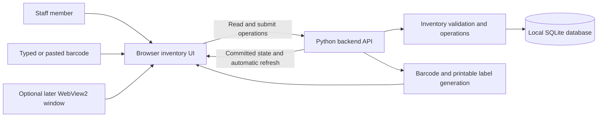
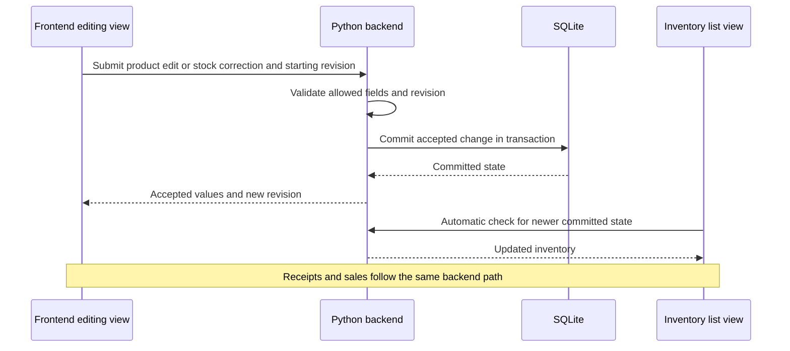
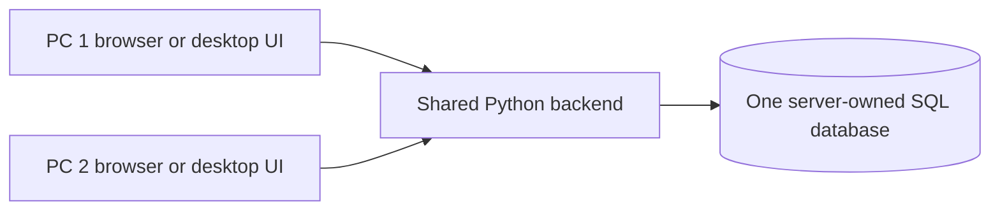

# Inventory system: working architecture

Status: initial one-PC skeleton implemented with a portable Windows browser release; later desktop-window and server deployment remain provisional. Updated: October 7, 2026.

This document describes the implemented one-PC skeleton and the intended boundaries for later development. Confirmed workflow requirements and outstanding product decisions are recorded in [plan.md](plan.md). Launch and backup instructions are in [../README.md](../README.md); [development.md](development.md) maps these components to source files and [api.md](api.md) records their exact HTTP contracts.

## 1. Architectural direction

Use a Python application backend as the only authority for inventory operations, with SQLite as initial persistent storage. The frontend is the sole interface for viewing and editing inventory and stock. It initially runs in a browser and may later use a desktop wrapper around the same screens.

Excel is excluded from the architecture and implementation scope.

The presentation technology can change without changing the stock rules. The same boundary allows the backend and database to move to a local or cloud server later.

### One-PC skeleton

All components run on one PC. The backend binds to loopback for the local skeleton. `Start Inventory.cmd` starts the source launcher; the portable `Windowstock.exe` contains the same launcher with its Python runtime and web assets. Both start the backend and open the default browser. A native/WebView2 desktop window and installer remain future work.

## 2. Component responsibilities

| Component | Responsibility |
| --- | --- |
| Frontend | Inventory display and editing, product forms, controlled stock corrections, receive/sale mode, scan simulation, operation status, stock history, and label preview. |
| Optional desktop host | Window, launch/shutdown coordination, local backend lifecycle, and any validated native printing integration. |
| Backend API | Read inventory and accept product edits, receipts, sales, returns, corrections, and label requests. Provide committed state for automatic client refresh. |
| Inventory operations | Validate identity, item counts, nonnegative stock, conflicting edits, and operation retries. Apply stock and history changes together. |
| Database access | Persist and query inventory in transactions. Keep SQL/database-specific code separate from UI behavior. |
| Barcode/label generation | Encode stable barcode values and produce scalable/printable labels without changing stock. |
| Backup/restore | Create recoverable database backups through a supported backup method and document restoration. |

Implemented stack: FastAPI/Uvicorn, SQLAlchemy, SQLite, plain HTML/CSS/JavaScript, and python-barcode. Dependencies are pinned in the project requirements files and installed in `.venv` with Python 3.14.8. PyInstaller packages the Windows executable, runtime, and frontend as a one-folder ZIP. SQLAlchemy helps isolate persistence, but changing database engines still requires migrations and verification.

### Portable release boundaries

The saved configuration in `packaging/windowstock.spec` and root `Build Release.ps1` create generated output only under `release/`. Packaging copies program code and assets into the bundle; subsequent source edits do not update that snapshot. The browser UI continues to call the same local backend API, with port 8767 as the packaged default and 8765 for development.

`release/Windowstock.zip` archives the contents of `release/Windowstock/`, with the executable and supporting files directly at the ZIP root. It does not include an enclosing `Windowstock/` folder. The recipient extracts the whole archive into a writable folder and launches the executable there.

Bundled web files are read from PyInstaller's resource directory. The release creates `data/inventory.sqlite3` beside its executable in the recipient's writable extracted folder. Development uses the project's own `data/inventory.sqlite3`. These databases are independent; no development database is copied into the ZIP. Updating the program must preserve the recipient's data or restore a consistent backup, and schema changes need an explicit migration. Build outputs and disposable QA copies are not the permanent home for company inventory. See [release.md](release.md) for operational steps.

## 3. Initial data model

The database contains products, stock movements, and submitted stock operations. The operation table persists request identifiers, their payloads, and their original responses for safe retries after a restart. Extra tables should be added only when a concrete requirement warrants them.

Actual table names are `products`, `stock_movements`, and `stock_operations`. Startup creates missing tables but does not migrate an existing schema. Any schema change needs an explicit upgrade procedure validated on a backed-up database; see [development.md](development.md#persistence-and-invariants).

### Products

- Stable internal product ID.
- Unique barcode string identifying a sellable variant.
- Name and description.
- Optional category, brand/model, colour, material, dimensions with units, location, and price.
- Quantity on hand as a nonnegative whole number of items.
- Revision used to detect stale edits.
- Active/archive state and creation/update timestamps.

Price is optional, displayed as CAD, and stored as integer cents. Product name is required; the remaining descriptive fields are optional. Final company-specific fields remain open.

### Stock movements

- Movement ID and referenced product ID.
- Type: receipt, sale, return, or correction.
- Signed whole-number quantity change.
- UTC timestamp; the movement type identifies the stock operation.
- Required reason for a correction; optional reason for other movement types.
- Unique submitted-operation identifier to prevent applying a retried operation twice.

A product starts at zero stock. Its current quantity must agree with its recorded movements. Updating the balance, inserting its movement, and updating the revision happen in one database transaction. Partial updates must roll back.

Sold-out products retain their records and history. Product archival preserves movements and references and is allowed only at zero stock. There is no hard-delete API. Movement listing uses the product's current name; metadata changes are not themselves recorded in stock history. Barcode generation is separate from receiving inventory.

## 4. Shared write and consistency rules

All clients submit requests to the backend; they do not modify SQL tables directly.

For a stock operation, the backend resolves the barcode, validates the request, applies the quantity delta and movement atomically, and returns the committed quantity and revision. Sales must check current stock within the write transaction so simultaneous requests cannot oversell.

For a metadata edit or a request to set a corrected quantity, the client includes the revision it edited. The backend rejects a stale edit rather than overwriting newer committed data. A correction requires a reason and records the difference as a movement after validating that revision.

Example: a frontend editing view displays five units. A sale in another view commits and leaves four. The editing view then attempts to set quantity to six using its old revision. The correction is rejected and the user sees the current quantity before deciding on a new correction. A stale form must not erase the sale.

Receive and sale requests are deltas, so two legitimate scans of the same product can both succeed. Each deliberate scan has a new submitted-operation identifier. A network retry reuses its original identifier and returns the original result instead of changing stock again. That replay is the original operation's product/movement snapshot, not current inventory; the frontend refreshes afterward. Identical barcode text alone must never be used to deduplicate scans.

Frontend views display committed database state. Supporting records, such as stock movements, are exposed through appropriate inventory and history screens rather than direct editing of SQL tables.

## 5. Scan simulation and labels

The scan adapter initially consists of an input field plus submission through Enter or a button. Its output is a barcode value and explicit receive/sale intent. It calls the normal backend operation and displays success or a specific rejection.

Every unit of the same product variant shares its barcode. Each deliberate receipt submission adds its selected count; each deliberate sale submission removes its selected count, provided stock is available. The count defaults to 1 and must be a positive whole number. One grouped submission produces one movement for its complete delta. Overselling returns **Not enough in stock.** and rolls back the whole operation. Typed or pasted submissions simulate scans until hardware is available.

The frontend provides +/− and direct count entry beside each receive/sale button, resetting to 1 after success. It blocks invalid entries and locks all count controls while a stock request is active or pending confirmation. Manual reductions go through the separate correction flow reached from Edit product; correction quantity remains a nonnegative target count rather than a signed receipt delta. No schema migration is required for grouped quantities because movements already store signed integer deltas.

Future keyboard-input scanners can use the same interaction. Hardware-specific behavior, input focus, Enter suffix, barcode support, and repeated-scan handling will be checked with the actual scanner.

Code 128 is the implemented internal label format. The same stored barcode is used for every identical unit and every reprint. Label generation does not create products or adjust inventory. The label template preserves readable text, barcode margins, and physical sizing, with final dimensions selected against the printer and label stock. The dedicated `/print` page supports copy count and label dimensions, then offers the browser's print/PDF dialog.

Browser print/PDF preview is adequate for the skeleton. WebView2 printing behavior and direct printer integration require a separate packaging/hardware check.

## 6. Frontend updates and operation status

### Implemented data flow

After a successful write, the submitting view immediately displays the returned committed values. Other open frontend views poll the backend every three seconds while visible. Unsaved form values and starting revisions are preserved. An uncertain stock request retains its original request identifier in browser session storage across reloads and print-page navigation, so Retry does not become a new scan. Server push can replace polling later if justified.

Frontend requirements:

- Identify products by stable product ID rather than their displayed row position.
- Validate all submitted fields server-side.
- Create products through a form that collects required fields before submitting.
- Treat quantity edits as controlled corrections with a reason and a current revision.
- Preserve edits still being entered or awaiting acknowledgement; incoming refreshes must not silently overwrite them.
- Distinguish pending, accepted, invalid, conflicting, and disconnected states.
- On reconnect, reload committed state and resolve stale edits before accepting new corrections.
- Show connection errors and lock new stock submissions while a previous request has an uncertain result. Resolve it through the pending-request controls; there is no offline queue.

## 7. Future shared-server deployment

Move the backend and database to a designated local server or cloud host. Client windows use a configured API address. Do not distribute independently editable inventory database copies or have client PCs write a shared SQLite file over a network drive.

SQLite can support modest workloads behind one application server. A server database such as PostgreSQL becomes a candidate when concurrent writes, hosting, backup, or availability requirements justify it. [SQLite's guidance](https://www.sqlite.org/whentouse.html) distinguishes application-server use from direct multi-PC access to a database file.

Before this phase, add the required authentication/permissions, HTTPS, configuration, backups, migration tooling, monitoring, and server startup/update procedures. Cloud or LAN offline stock operations require a separate design and are not promised by desktop packaging.

## 8. Validation and remaining milestones

The skeleton has 89 passing API integration, local-access, and portable-runtime tests as of October 7, 2026. They cover stock transactions, grouped counts, strict quantity validation, legacy/grouped retries, stale edits, concurrent bulk sales, barcode generation, backup restoration, local request restrictions, and frozen resource/database/listener isolation. Browser checks cover product creation/editing, repeated and grouped receipts, sales, insufficient-stock rejection, invalid count entry, corrections, returns, history, archive/restore, backup download, and rendered label sheets. New installations start empty; validation uses a separate database.

The actual packaged executable also passed startup, asset loading, separate empty database, grouped stock, oversale rejection, SVG barcode, backup, forced restart, and retry checks on October 7, 2026. The smoke test launches a disposable staged copy from another working directory with no Python on `PATH`; the development database sentinel remains unchanged. See [release.md](release.md#verification-recorded-october-7-2026) for the recorded result and repeatable process. A second Windows PC has not yet been tested.

Physical scanner/printer checks, a native/WebView2 desktop window, and shared-server deployment remain pending. Browser print/PDF output must be reviewed in the company's chosen browser and with its chosen label stock; the current automated browser checked rendered labels without producing a PDF. Review the extracted ZIP on the destination PC as part of demonstration handoff.

Core demonstration:

- Create one product at zero stock and generate a label.
- Receive the same barcode three times and see quantity three.
- Sell it once and see quantity two; sell the remainder and reject another sale.
- Receive a grouped count, sell part of it, and reject an overlarge sale without a partial change. Confirm retries preserve the whole grouped count and count it once.
- Verify movements match the balance, data survives restart, and a failed operation changes neither balance nor history.
- Retry one submitted operation and confirm it counts once; submit two deliberate scans and confirm both count.
- Reject an unknown barcode and invalid item counts without changing inventory.
- Preview/print a label to PDF; record physical printer/scanner validation as pending.
- Produce and restore a backup in an isolated validation location.

Frontend consistency:

- A product edit or stock correction updates the database and displays the committed values.
- A receipt/sale refreshes other open inventory views.
- Invalid edits and stale quantity corrections are rejected with a useful explanation.
- Refreshes preserve unsaved form edits and clearly identify conflicts.
- Backend restart, disconnect, and reconnect show correct status without duplicate writes or lost stock movements.

The portable release must start correctly from an extracted folder, display the bundled UI, keep the backend available while its console stays open, and support the same label preview/printing workflow. A later desktop host requires its own lifecycle and printing validation.
